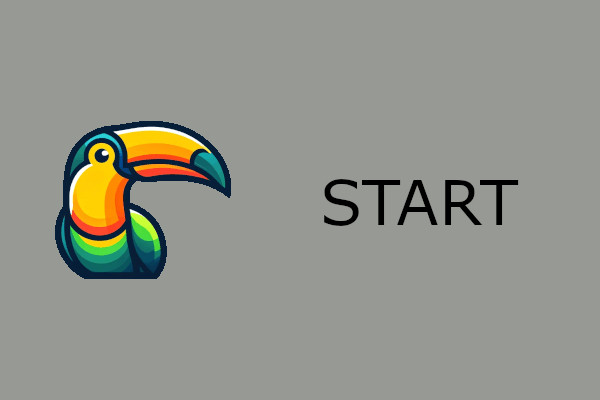

# START

## Introduction

Thank you for purchasing Try-O-Theme! This theme is built on the powerful Toucan static site generator, which uses Markdown for content creation and Mustache templates for layout and design. This combination makes it simple to add, edit, and manage your site’s content while ensuring a visually appealing and professional design.

With Markdown, you can write formatted text in plain-text files, which Toucan converts into HTML. Mustache templates allow you to customize the layout and presentation of your site with clean, readable syntax. Together, they give you full control over both the content and appearance of your site.

This guide will walk you through essential tasks, such as changing the site logo, adding new content (tags, authors, posts), and customizing your site’s pages and footer. It also includes Markdown basics and instructions to deploy your site to GitHub Pages for a smooth publishing process.

## Change content

Customize your site’s content easily by following the guides below:

- [Change the site logo](/posts/change-site-logo): Learn how to replace the default logo with your own custom branding.
- [Add a new tag](/posts/new-tag): Categorize your posts by creating new tags to enhance navigation.
- [Add a new author](/posts/new-author): Showcase contributors by adding author profiles with bios, images, and social links.
- [Add a new post](/posts/new-post): Publish new content with Markdown and associate it with tags and authors.
- [Create a custom page in navigation](/posts/new-navigation): Add static pages, like “About” or “Contact Us,” and include them in the navigation menu.
- [Customize the footer](/posts/change-footer): Update your site’s footer with social links, copyright information, and custom text.

Each guide is designed to provide step-by-step instructions to make the customization process seamless.

## Markdown basics

Markdown is a lightweight and versatile markup language that simplifies formatting. Learn the essentials with the following posts:

- [Markdown basics part1](/posts/markdown-basic): Covers headings, bold/italic text, blockquotes, and lists.
- [Markdown basics part2](/posts/markdown-basic2): Explores advanced features like images, links, code blocks, and tables.

Whether you’re new to Markdown or need a refresher, these guides will help you master its simplicity.

## Deploy to github

Take your site live with GitHub Pages:

- [Deploy to a GitHub Page](/posts/github-deploy): Step-by-step instructions for deploying your docs folder to GitHub Pages, making your site accessible to the world.

This guide ensures you can easily manage updates and publish changes to your site.

## Closing Notes

Thank you again for choosing Try-O-Theme! If you have any questions or need further assistance, feel free to:
- [Contact](https://toucansites.com/contact/) us directly.
- Check the Toucan [documentation](https://toucansites.com/docs/) for detailed guidance.
- Explore the examples provided in this guide.