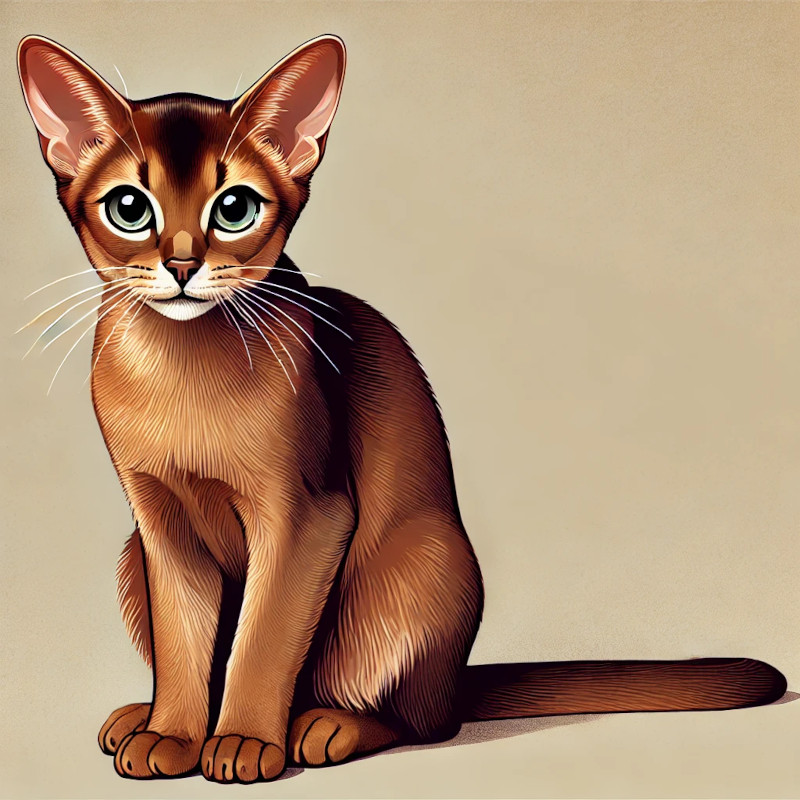

# Abyssinian

The Abyssinian is an extraordinary breed of domestic cat, admired for its distinct appearance and personality. It is widely recognized for its unique coat patterns. These cats have a rich history and have become a favorite among cat lovers.

## History and Origin
The Abyssinian originated from modern breeding programs. This breed's historical significance is often linked to breeding enthusiasts. Today, the Abyssinian is cherished for its companionship.

## Physical Characteristics
- **Coat**: The Abyssinian is known for its silky and smooth coat.
- **Body**: It features a medium-sized and athletic body type.
- **Eyes**: This breed typically has round expressive eyes, which add to its charming appearance.

## Personality and Behavior
The Abyssinian is playful and enjoys exploring. It is highly intelligent and makes an excellent companion for first-time cat owners.

## Health and Care
On average, the Abyssinian lives for 12 years. Proper care includes a balanced diet, regular grooming, and routine veterinary checkups to ensure optimal health. Owners often highlight the Abyssinian's resilience and adaptability.

With its remarkable personality, the Abyssinian continues to win hearts worldwide.
